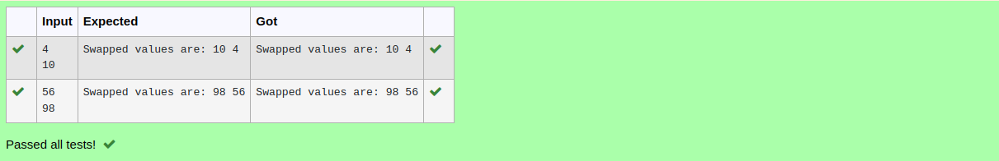

# Swapping-two-values
## AIM:
To write a python program for swapping of two values
## EQUIPEMENT'S REQUIRED: 
PC,
Anaconda - Python 3.7
## ALGORITHM: 
### Step 1:
Get the two values from the user.
### Step 2: 
Assign the value of second variable to a temporary variable .
### Step 3: 
Assign the value of the first variable to the second variable.
### Step 4:  
Assign the value in temporary variable to the first variable.
### Step 5: 
Print both the values it would be interchanged.
### Step 6: 
End the program.
## PROGRAM:
```
#Program to circulate N values.
#Developed by: Sujithra B K N
#RegisterNumber:22008582
a=eval(input())
b=int(input())
def circulate():
    for n in range (b+1):
        c=a[n:]+a[:n]
    return c
print("After circulating the values are:",circulate())
```
## OUTPUT:

## RESULT:
Thus the swapping of two values are successfully executed.